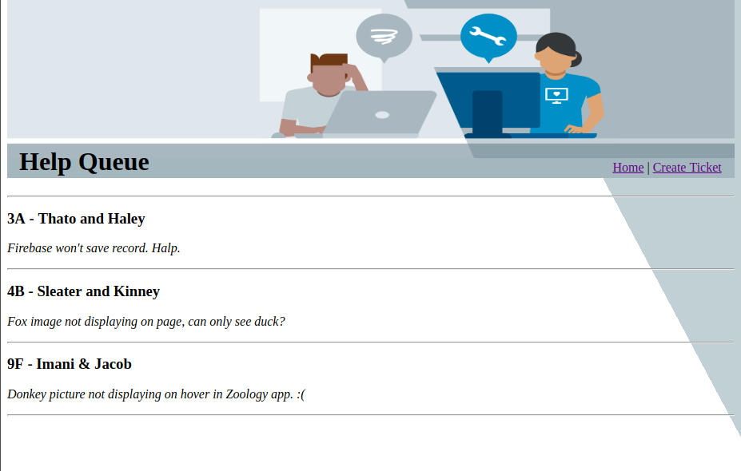

# Student Help Queue

An [Epicodus](https://www.epicodus.com/) project - created 11.01.18 
By _**Catherine Bradley**_ 
Contact: _**catherinetybradley@gmail.com**_ 

## Description
Mock help queue for coding students.

| User Story |
|----|
| User is greeted by a splash page containing current help tickets |
| User can click "Create Ticket" on splash page to navigate to a new ticket form |
| If User enters an invalid route in the URL, they are greeted by an Error404 page |

## Setup/Installation Requirements

1. clone this repository
2. navigate to project root directory
3. type **npm install**
4. type **npm run start**
5. navigate to localhost:8080

## Technologies Used
* _ReactJS_
* _webpack-npm_
* _esLint_
